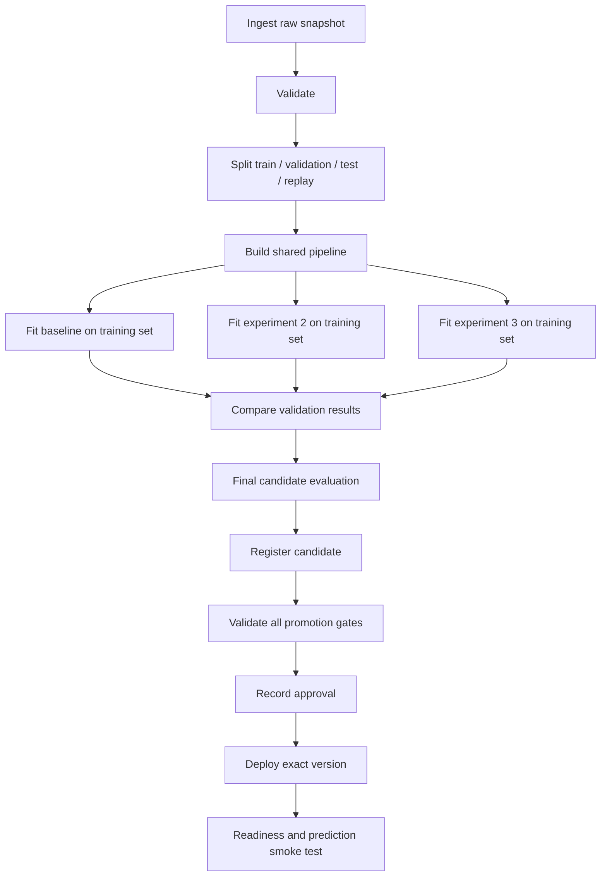

# Proposed system architecture

**Status: P0 integration framework implemented; complete lifecycle pending.** Runner/gates, Airflow DAG, container configuration/wrappers and CI files exist. Data/model/API/quality-monitoring adapters and real container/registry/deployment evidence remain assigned work. [P0 handoff](P0_HANDOFF.md) records the executable boundaries and verification limits; this document retains the target complete architecture.

The selected task is binary credit-card default prediction using [UCI Default of Credit Card Clients, dataset 350](https://archive.ics.uci.edu/dataset/350/default%2Bof%2Bcredit%2Bcard%2Bclients). UCI lists 30,000 examples, 23 features, no missing values, and a binary target with `1` meaning default and `0` meaning no default. The project is a classroom decision-support prototype; a real stakeholder interview and topic approval still need evidence. See [Project brief](PROJECT_BRIEF.md), [Development plan](DEVELOPMENT_PLAN.md), and [Interface contracts](INTERFACE_CONTRACTS.md) for remaining decisions and the concrete credit-feature schema.

## Architecture and responsibilities

```mermaid
flowchart LR
    Raw[(Versioned raw data)] --> Validate[Validate schema and data quality]
    Config[Versioned configuration] --> Validate
    Validate --> Split[Reproducible train / validation / test / replay split]
    Split --> Train[Fit shared preprocessing + train experiments]
    Train --> Evaluate[Compare runs and evaluate candidate]
    Train --> Track[(MLflow tracking and artifacts)]
    Evaluate --> Track
    Evaluate --> Registry[(Versioned model registry)]
    Registry --> Candidate[Isolated candidate API performance check]
    Candidate --> Gates{Quality and service gates pass?}
    Gates -->|Yes| Approved[Record approval]
    Gates -->|No| Rejected[Reject candidate and retain current model]
    Approved --> Deploy[Deploy exact model version]
    Deploy --> API[Containerized prediction API]
    Previous[(Previous deployment)] --> Deploy
    Client[External client] --> API
    API --> Telemetry[Metrics and structured logs]
    API --> Predictions[(Prediction events)]
    Labels[Delayed ground-truth feedback] --> Join[Join labels to predictions]
    Predictions --> Join
    Join --> Monitor[Quality / data drift / concept drift checks]
    Predictions --> Monitor
    Telemetry --> Monitor
    Monitor --> Alert[Persist alert and surface to operator]
    Monitor -->|Retraining policy satisfied| Retrain[Trigger controlled retraining flow]
    Retrain --> Validate
    CI[CI: code / data / model checks] --> Gates
```



All training nodes form an Airflow DAG with explicit task dependencies. Required downstream tasks use success-dependent execution; a failed validation or gate must block training/promotion as appropriate. A wrapper must wait for the DAG's terminal result and deployment checks, because triggering a DAG is not the same as finishing it. [Airflow DAG documentation](https://airflow.apache.org/docs/apache-airflow/stable/core-concepts/dags.html)

| Component | Proposed choice | Team responsibility / reason |
| --- | --- | --- |
| Version control | Git + GitHub | Branches and PR reviews; provenance for experiments |
| Data validation | TensorFlow Data Validation (TFDV) | Versioned schema, descriptive statistics, anomaly and skew/drift reports |
| Shared transformations and model | Python + scikit-learn for a tabular baseline | Small reproducible model with persisted preprocessing |
| Experiment tracking and registry | MLflow | Compare runs, record artifacts, manage versioned models |
| Orchestration | Apache Airflow | One executable DAG with inspectable task dependencies and failures |
| Serving | FastAPI | Containerized request/response API with validation and health endpoints |
| Packaging | Docker Compose | Local deployment from a clean machine using pinned dependencies |
| Monitoring | Prometheus + Grafana plus project quality/drift jobs | Service dashboards and label-based model monitoring |
| CI/CD | GitHub Actions | Enforce code, data, and model gates and record pass/fail evidence |

These tools are the team's selected stack. P0 implements the runner, gate policy, Airflow graph, Compose/wrappers and CI framework; real friend components and actual container behavior remain pending. See [P0 handoff](P0_HANDOFF.md) for executable mappings, pins and verification limits. Every required capability is listed in [Requirements](REQUIREMENTS.md). P1 resolves compatible TFDV dependencies in the Linux worker, while P3 supplies API/runtime model dependencies.

## Proposed runtime topology

| Service | Host port | Internal role | Persistence |
| --- | --- | --- | --- |
| `api` | `8000` | Prediction, feedback, health, metrics | Active immutable model bundle; prediction/feedback event storage |
| `mlflow` | `5000` | Tracking UI/API and model registry | Database-backed metadata store and artifact volume |
| `airflow` web/API service | `8080` | Orchestration UI/API for local runs | Metadata database volume |
| Airflow scheduler and task runner | No inbound host port required | Executes training and monitoring DAGs | Reads data/config; writes run reports and artifacts |
| `prometheus` | `9090` | Scrapes API and monitoring metrics | Time-series volume |
| `grafana` | `3000` | Service and model dashboards | Dashboard/config volume |

MLflow's registry requires a database-backed backend; use a configured SQLite database for the initial local demo and a persistent artifact volume. Choose a server database if the team needs concurrent remote use. Registry aliases name particular model versions and version tags can record validation state. Do not base the design on deprecated MLflow stages. [MLflow registry workflow](https://mlflow.org/docs/latest/ml/model-registry/workflow/)

Compose must define health checks, named volumes, internal service URLs, and the published API port. The API must be callable from outside its container. Local ports are a convention to implement, not working services today. Limit shared data/config/artifact locations to documented volumes; no component should depend on a teammate's absolute filesystem path. Use a complete lockfile and pinned container images. Keep local secrets in an ignored environment file and provide a safe `.env.example`.

## Proposed repository boundaries

```text
src/mlops_project/
  data/          # Ingest, validate, split, dataset manifests
  features/      # One transformation pipeline definition
  training/      # Baseline, experiment execution, evaluation
  registry/      # P2 model registration and lifecycle/alias finalization
  serving/       # API, runtime model loader, event logging
  monitoring/    # Windows, label joins, drift/quality checks, alerts
  pipelines/     # P0 runner, gates, deployment/rollback and retraining
dags/            # Airflow DAG definitions; keep imports lightweight
configs/
  project.yaml       # Task, target, seed, experiment configurations, SLO
  data_schema.yaml   # Column mapping and pointer to the canonical TFDV schema
  quality_gates.yaml # Optimizing metric and promotion gates
  monitoring.yaml    # Windows, thresholds, triggers, cooldown
schemas/
  credit_default.pbtxt     # Reviewed TFDV schema, including TRAINING/SERVING environments
tests/               # Meaningful contract and integration checks
data/                 # Raw/processed local data; ignored where appropriate
artifacts/            # Generated bundles, reports, events; ignored
docs/                 # Decisions, instructions, evidence index, report
```

P0's pipeline/config/DAG/container files now exist; data/features/training/registry/serving modules above remain assigned work. Each component exposes artifacts described in [Interface contracts](INTERFACE_CONTRACTS.md) and exact callable-stage fields in [P0 handoff](P0_HANDOFF.md). Named owners are recorded in [Team work](TEAM_WORK.md).

## Data and model lifecycle

1. Ingest an immutable UCI dataset snapshot and record its origin, license, row count, checksum, and label availability. Normalize `X1`–`X23` or workbook headings through one reviewed column mapping; keep `ID` for provenance and split identity, never as a predictor.
2. Validate the full raw dataset against the versioned schema. A hard failure records a report and alert, fails the run, and prevents splitting, training, registration, or promotion. Keep the currently deployed service available.
3. Split before learning any preprocessing parameters. The proposed initial split is stratified by target with seed `42`: 60% training, 20% validation, 10% final test, and 10% monitoring replay, with disjoint client IDs. The dataset contains historical repayment features per client, not a sequence of repeated monthly client rows; do not claim this random row split measures future deployment performance. Keep the final test and replay partitions separate from training/tuning. See [Dataset plan](DATASET.md).
4. Fit preprocessing and the model on training data only. Compare at least three reproducible experiment runs with the same evaluation contract, including a baseline. Choose configurations using validation results and record why the final candidate was selected. Use the held-out test set once for the locked initial candidate's final assessment; do not reuse it for retraining or current-regime promotion decisions.
5. Log code version, data version, hyperparameters, metrics, output artifacts, and environment for every run. Proposed optimizing metric: positive-class (`1`) `average_precision` (AP), larger is better. Report ROC AUC, recall, precision, F1, calibration/Brier score, and the threshold selected using validation data. AP and a trapezoidal PR-AUC are different definitions; name the actual computation. Link these measurements to the agreed business cost proxy rather than claiming accuracy alone measures business value.
6. Persist the entire fitted preprocessing-plus-estimator pipeline and its input/output contract as one bundle. Serving accepts raw feature values and calls that same fitted pipeline; it must never independently refit or reimplement preprocessing.
7. Evaluate the selected candidate against absolute quality gates, compatible input/output schema, baseline/current-model comparison, and measured latency/resource gates. P3 supplies an isolated candidate-serving harness using the same API image and exact candidate bundle; P0 wires it before approval in the DAG. Measure this running API under the stated workload without switching the live champion. Save gate results tied to the candidate/image and record approval. A benchmark of a different deployed model cannot satisfy the candidate's performance gate.
8. Register an immutable version and deploy that exact artifact only after approval. Record deployment identity, health-check evidence, and the previous version for rollback.

The shared fitted pipeline and train-only preprocessing follow scikit-learn's guidance on consistent preprocessing and avoiding leakage. [scikit-learn common pitfalls](https://scikit-learn.org/stable/common_pitfalls.html)

TFDV computes statistics and validates them against a reviewed `schemas/credit_default.pbtxt`, with `TRAINING` and `SERVING` environments so `default_next_month` is required for training and excluded from serving. `configs/data_schema.yaml` references that canonical schema and the raw-column mapping. During the one-time schema setup, structurally inspect the source, reserve split IDs, infer a draft from training data, review it, and freeze it before the repeatable DAG is accepted. Never infer a new permissive schema from each incoming batch. TFDV returns anomalies; the application must inspect them, persist a report/alert, and raise on hard failures. Add row-level checks for IDs, strict types, and non-finite values where aggregate statistics alone are insufficient. [TFDV validation and schema environments](https://www.tensorflow.org/tfx/data_validation/get_started)

The source is documented without missing values, so required columns and nulls initially fail. If the team authorizes an imputable numeric feature in a later schema revision, only present `null` values in that feature pass; its imputer is fitted on training data. Invalid category codes, labels, and non-finite values fail according to the reviewed schema. Preserve legitimate negative bill balances and audited special category/repayment codes; do not silently treat them as corruption. An outlier policy must be fixed in the feature contract and learned only from training data when it has learned parameters.

## One-command DAG and retraining

The command interface is implemented in [Getting started](GETTING_STARTED.md); Docker builds/real execution are unverified here. `scripts/run-all.ps1` and `scripts/run-all.sh` bootstrap services, use pinned Airflow 2.10.5 REST/Basic auth, wait for the DAG's terminal state, verify persisted deployment ACK plus live exact-version readiness/prediction, and return nonzero on failure. Missing friend adapters or unset gates fail preflight. The target lifecycle is:



Training runs can execute concurrently if resources allow. Set a serialized deployment/retraining policy (`max_active_runs`/pool or equivalent) so competing runs cannot overwrite the serving model. Pass artifact URIs and checksums between tasks rather than large dataframes or model objects in XCom. A validation/gate failure terminates downstream deployment, saves diagnostic evidence, and leaves the serving model unchanged. Retrying transient infrastructure failures is allowed; retrying invalid data without correction is not useful.

Monitoring triggers the same flow with a new approved data snapshot. A trigger is conditional on enough labeled examples, a recorded alert, the retraining cooldown, and no concurrent retrain. Promotion may be automatic in the classroom demo after all machine-verifiable gates pass; record the approval actor as the policy, its version, and gate evidence. Manual approval can also be configured, but the unattended one-command demo must have a documented policy that completes approval without an unrecorded manual action.

Retraining success alone does not authorize deployment. A newly trained model that fails comparison or service gates is rejected; preserve the current serving model and expose the failure. Save one complete detect → trigger → validate → train → evaluate → approve → deploy trace for the demonstration.

## Registry, deployment, and rollback

The application lifecycle is separate from MLflow's artifact availability status:

| Application state | Meaning |
| --- | --- |
| `candidate` | Registered artifact; promotion checks pending |
| `validated` | All configured checks passed with linked evidence |
| `approved` | A named person or versioned automatic policy authorizes deployment |
| `deployed` | Deployment is serving this exact version and passed readiness/smoke checks |
| `retired` | Previously served version intentionally superseded |
| `rejected` | Candidate failed a gate or was declined |
| `rolled_back` | A deployment of this version was undone after failure |

Use application tags for lifecycle metadata and `champion` / `previous` aliases (or an explicit version mapping) to record the intended and rollback versions. A rollback target must remain loadable and compatible. The runtime reports the exact version it actually loaded; changing an alias does not by itself reload an existing server.

For the first implementation, use one API process and serialized deployment operations. P0's deploy task atomically replaces `artifacts/deployments/desired-model.json` in a shared volume with the approved exact version, artifact checksum, gate-report reference and deployment ID. P3's API background watcher reads that control manifest, stages/verifies the bundle while the old model continues serving, then swaps the active pointer atomically. It writes an acknowledgement with `contract_version: 1` for that deployment ID and loaded version. Each request captures one bundle at its start and returns that bundle's version. P0 waits for acknowledgement, matching model/schema `/ready`, and a valid prediction before calling P2's alias/tag finalization and recording a confirmed active manifest. If acknowledgement, probes, or alias updates fail, restore the prior confirmed healthy approved manifest, verify serving and restore registry mappings, record the failed deployment, and emit an alert. First-deployment failure requests unload, requires an `unloaded` acknowledgement with `contract_version: 1` plus readiness 503/health 200, and clears aliases through P2. Unconfirmed recovery fails explicitly. [P0 handoff](P0_HANDOFF.md) records the exact callback, tombstone and manual rollback command.

Maintain an append-only deployment history and reconcile registry mapping with runtime version after restart. Multi-worker deployment requires coordinating all workers before marking a rollout complete; leave it out of the initial scope until the single-process contract is proven. Demonstrate rollback by deploying a second approved version and restoring the previously known-good version with API version evidence.

## Monitoring and drift evidence

| Signal | Evidence | Planned response |
| --- | --- | --- |
| Service health | Readiness, request counts/errors, p50/p95 latency, throughput | Alert on agreed SLO breach; diagnose or rollback a failing deployment |
| Input validity | Validation failure counts and failure reports | Reject invalid batch/request; alert at configured severity/frequency |
| Data drift | Feature distributions in a monitoring window versus a fixed reference | Save per-feature statistics; alert; investigate before retraining |
| Prediction quality | Predictions joined to ground-truth labels, grouped by exact model version | Compare task metric to reference and configured minimum quality |
| Concept drift | Controlled evidence of changed relationship between features and labels, including labeled quality decline | Alert, qualify retraining data, run controlled retraining and gates |

TFDV supplies input-distribution statistics and configured skew/drift comparisons; Prometheus/Grafana expose those results alongside service and labeled-quality measurements. Data drift is a change in the input distribution; it does not prove concept drift. Unlabeled predictions or feature statistics alone cannot demonstrate a changed feature-to-label relationship. Obtain delayed ground truth through `/feedback` or an equivalent versioned label file. Join by request ID and instance index, never by row position across unrelated files.

For a demonstrable distinction, use training data for reference statistics and the reserved replay partition for healthy monitoring. Create a data-drift scenario that changes feature distributions and a separate concept-drift scenario that preserves similar feature distributions while changing the label-generating relationship. These are controlled historical/synthetic replays, not observed future changes in Taiwanese clients. Record simulation code, seeds, and measured differences. Model-quality degradation in live data is an investigation signal; the controlled labeled scenario supplies the course demonstration evidence.

Retraining a simulated regime must use separately reserved training examples, with separate simulated-regime validation examples for promotion. Alarm/evaluation replay rows and the frozen final test set cannot become retraining data. Define the current-regime promotion policy in advance, and also report candidate performance on the original validation set to disclose regressions. A rejected retrained candidate is a valid outcome; never fabricate improvement to force the demonstration to succeed.

At planning time, set reference/monitoring window sizes, minimum labeled rows, test/statistic, alert thresholds, persistence across windows, and cooldown in `monitoring.yaml`. Treat suggested defaults as provisional until tested against the selected dataset. When labels or sample size are insufficient, report `insufficient_data`, not `no_drift`. Retain reference snapshots for each deployed model and avoid mixing different model versions in a single quality result.

## Reliability, measurements, and acceptance

Declare service SLOs before performance testing, including p95 latency, accepted error rate, and a throughput target at a stated concurrency and batch size. Record hardware, dataset, warmup, request mix, run duration, sample count, and p50/p95 results. Compare measurements with the declared SLO and keep the raw results.

Load the model at application startup and expose readiness only after a compatible bundle is available. FastAPI's lifespan mechanism supports loading shared model resources before handling requests. [FastAPI lifespan documentation](https://fastapi.tiangolo.com/advanced/events/)

CI must run three real gates: code quality, data validity, and model quality. Promotion consumes the gate report tied to the same commit, schema, data snapshot, and model artifact; a stale passing result does not count. Keep one passing and one failing CI run as evidence. Model tests in CI may use a reproducible bounded fixture; the full-dataset evaluation report remains a separate promotion requirement.

Acceptance evidence and abnormal-input cases are specified in [Testing and demo](TESTING_AND_DEMO.md). Report the final architecture, measured results, limitations, tool rationale, and AI assistance in [Report template](REPORT_TEMPLATE.md). Update this document when the team makes an approved design change and when planned components become implemented.
